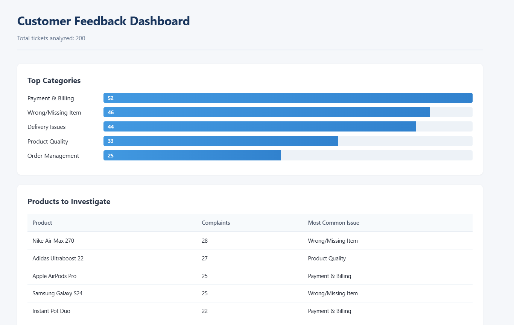

# AI-Powered Customer Feedback Analyzer

Turn 200+ customer support tickets into structured insights and an actionable HTML dashboard — automatically.

A Python tool that reads e-commerce customer support tickets, uses the Gemini AI API to classify each one by problem category, urgency, and ambiguity, then generates an HTML dashboard surfacing the patterns a business owner needs to act on.

---

## Sample Output

The tool generates a clean HTML dashboard with four actionable sections:

1. **Top Categories** — Horizontal bar chart showing ticket distribution across 5 problem categories
2. **Products to Investigate** — Top 5 products by complaint count, with their most common issue type
3. **Urgent Tickets — Action Required** — Scrollable table of high-urgency tickets with customer contact info, ready for immediate action
4. **Ambiguous Classifications — Manual Review** — Drill-down table of tickets where the AI flagged its own uncertainty, for human review



---

## The Problem

Small and mid-sized D2C brands receive hundreds of customer support tickets per week. Manually reading them to spot patterns — which products are problematic, which issues are urgent, where to focus this week — takes hours of operations time every Monday.

This tool automates that loop. Raw tickets in → structured insights out, ready for a 5-minute Monday-morning review.

---

## How It Works

tickets.csv (200 raw tickets)
↓
[1] data_loader.py        → Loads CSV, validates schema, returns lean dicts for AI
↓
[2] ai_classifier.py      → Batches tickets, calls Gemini API, validates JSON output,
handles retries and rate limits, saves classifications
↓
[3] aggregator.py         → Joins classifications + ticket data, calculates category
distributions, top problem products, urgent tickets list
↓
[4] dashboard.py          → Renders aggregations into HTML via Jinja2 template
↓
dashboard.html (ready for a business owner to open)

Each module has a single responsibility. The pipeline is idempotent — re-running it skips already-classified tickets and never overwrites good data with failed runs.

---

## Tech Stack

- **Python 3.10+**
- **pandas** — data loading and joins
- **google-generativeai** — Gemini API client (`gemini-2.5-flash` model)
- **Jinja2** — HTML template rendering
- **python-dotenv** — secure credential management
- **faker** — sample data generation

---

## Setup

### 1. Clone and install

```bash
git clone git@github.com:amangupta-py/ai-customer-feedback-analyzer.git
cd ai-customer-feedback-analyzer
python -m venv venv
source venv/bin/activate          # On Windows: .\venv\Scripts\Activate.ps1
pip install -r requirements.txt
```

### 2. Configure credentials

Copy `.env.example` to `.env` and add your Gemini API key:

```bash
cp .env.example .env
```

You'll need a **Gemini API key** (free from [aistudio.google.com](https://aistudio.google.com)).

### 3. Generate sample data (optional)

```bash
python generate_sample_data.py
```

Creates `tickets.csv` with 200 realistic customer support tickets across 5 problem categories.

---

## Usage

**Run the full pipeline (one command):**

```bash
python main.py
```

This loads tickets, classifies any unclassified ones via Gemini, calculates aggregations, and generates `dashboard.html`.

**Open the dashboard:**

```bash
start dashboard.html      # Windows
open dashboard.html       # macOS
xdg-open dashboard.html   # Linux
```

---

## Project Structure

ai-customer-feedback-analyzer/
├── main.py                     # Pipeline orchestrator (entry point)
├── data_loader.py              # CSV loading + validation
├── ai_classifier.py            # Gemini API integration, batching, validation
├── aggregator.py               # Joins + business metric calculations
├── dashboard.py                # HTML rendering via Jinja2
├── generate_sample_data.py     # Creates realistic test data
├── templates/
│   └── dashboard.html          # Jinja2 dashboard template
├── requirements.txt            # Python dependencies
├── .env.example                # Configuration template
└── tickets.csv                 # Input data (generated)

Generated outputs (gitignored): `classifications.json`, `aggregations.json`, `dashboard.html`

---

## Design Decisions

A few intentional choices worth noting:

- **Batch processing** — Tickets are sent to Gemini in batches of 20 per API call. Reduces API calls from 200 to 10, runs ~20x faster than single-ticket classification, costs roughly 7x less.

- **Rate-limit-aware throttling** — 4-second delay between batches keeps the pipeline within Gemini free-tier daily quotas. Production deployment would use paid tier and remove throttling.

- **Idempotent classifier** — The classifier loads existing classifications first and only processes new tickets. Re-runnable without duplicate work. Refuses to overwrite the output file with empty results (preserves data on failed runs).

- **Strict JSON validation** — Every AI response is validated against an explicit schema: category must be one of 5 exact strings, urgency one of three, all required keys present. Mismatch raises an explicit error rather than silently corrupting data.

- **5 mutually-exclusive categories with edge case rules** — Each category in the prompt includes "Covers / Does NOT cover / Edge Case" rules to maximize consistency. Identical problems get identical classifications regardless of how customers phrase them.

- **`is_ambiguous` flag for borderline cases** — Instead of forcing the AI to confidently classify gray-zone tickets, it surfaces them for manual review. Section 4 of the dashboard is a drill-down for these cases.

---

## Known Limitations

- **Urgency distribution skews high** on the included sample dataset (~47% high-urgency). The sample data templates lean dramatic. Real deployment against production data would require recalibrating urgency rules in the prompt.

- **Free-tier API limits** — `gemini-2.5-flash` allows roughly 20 requests/day on the free tier. Re-running the classifier from scratch hits this cap. Paid tier ($5/month) raises this to 1000+ requests/minute.

- **No live data ingestion** — Current version reads from CSV. A production version would integrate with Freshdesk/Zoho/Zendesk APIs to ingest tickets directly.

---

## Future Improvements

- [ ] Integrate with helpdesk APIs (Freshdesk, Zoho, Zendesk) for live data
- [ ] Add fallback classifier (Anthropic Claude API) when Gemini hits quota
- [ ] Weekly/monthly trend analysis across multiple runs
- [ ] Email digest with the dashboard's top insights
- [ ] Per-product complaint rate (complaints / orders) instead of absolute counts
- [ ] Multi-language ticket support (Hindi/Tamil/etc. for Indian D2C brands)

---

## About

Built by **Aman Gupta** as part of a portfolio of AI-powered automation projects.

I help D2C and SaaS businesses turn unstructured customer data into actionable insights — using Python and modern LLM APIs.

📧 delhite.amang@gmail.com
🔗 [LinkedIn](https://www.linkedin.com/in/aman-gupta-242411233/)
🐙 [GitHub](https://github.com/amangupta-py)

---

## License

MIT — see [LICENSE](LICENSE) for details.